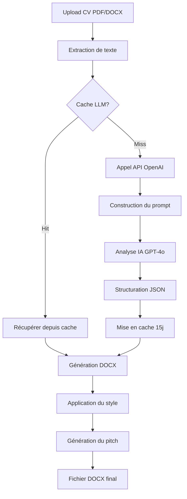

# 🚀 CV Generator - Convertisseur Intelligent de CV

[](https://www.python.org/downloads/)
[](https://openai.com/)
[](tests/)
[](htmlcov/index.html)

Système automatisé professionnel qui transforme vos CV PDF/DOCX en documents Word parfaitement formatés, enrichis et optimisés grâce à l'intelligence artificielle.

## ✨ Fonctionnalités

### 🎯 Fonctionnalités Principales

- ✅ **Extraction Multi-Format** : PDF, DOCX et DOC supportés
- ✅ **Analyse IA Avancée** : Structuration intelligente via GPT-4o/GPT-4o-mini
- ✅ **Génération DOCX Pro** : Formatage identique au template de référence
- ✅ **Amélioration de Contenu** : Mode basique et ciblé avec appel d'offres
- ✅ **Traduction Multilingue** : Français, Anglais, Italien, Espagnol
- ✅ **Limitation de Pages** : Condensation intelligente (1-4 pages)
- ✅ **Pitch Automatique** : Génération de profil candidat pour présentation client
- ✅ **Cache LLM** : Réduction des coûts avec cache de 15 jours
- ✅ **Calcul de TJM** : Suggestion automatique du Taux Journalier Moyen
- ✅ **Logging Professionnel** : Traçabilité complète avec logs rotatifs

### 🎨 Modes d'Amélioration

1. **Mode Standard** (`none`) : Extraction fidèle sans modification
2. **Mode Basique** (`basic`) : Reformulation professionnelle, correction orthographique
3. **Mode Ciblé** (`targeted`) : Adaptation du CV à un appel d'offres spécifique

## 📦 Installation

### 1. Prérequis

- **Python 3.8+** (testé avec Python 3.14)
- **Clé API OpenAI** avec accès à GPT-4o ou GPT-4o-mini
- **Système d'exploitation** : Windows, Linux ou macOS

### 2. Installation des dépendances

#### Production
```powershell
pip install -r requirements-prod.txt
```

#### Développement (avec outils de test)
```powershell
pip install -r requirements.txt
```

**Dépendances principales :**
- `openai>=1.0.0` : API OpenAI pour l'analyse IA
- `pdfplumber>=0.9.0` : Extraction de texte PDF
- `python-docx>=0.8.11` : Génération de fichiers Word
- `docx2txt>=0.8` : Extraction de texte DOCX
- `diskcache>=5.6.0` : Cache disque pour LLM
- `fastapi>=0.109.0` : API REST backend
- `streamlit>=1.30.0` : Interface utilisateur web
- `pydantic-settings>=2.1.0` : Configuration

**Dépendances de développement :**
- `pytest>=9.0.0` : Framework de tests
- `pytest-cov>=7.0.0` : Couverture de tests
- `pytest-asyncio>=1.3.0` : Tests asynchrones

### 3. Configuration

#### Méthode 1 : Fichier .env (recommandé)

```powershell
# Copier le template
Copy-Item .env.example .env

# Éditer le fichier .env
notepad .env
```

**Contenu minimal du .env :**
```env
# OpenAI Configuration
OPENAI_API_KEY=sk-votre_clé_api_ici
OPENAI_MODEL=gpt-4o-mini

# Application Settings
APP_TITLE=CV Generator Pro
ENVIRONMENT=production

# File Limits
MAX_FILE_SIZE_MB=10
ALLOWED_EXTENSIONS=pdf,docx,doc,txt
```

#### Méthode 2 : Variables d'environnement

```powershell
# Windows PowerShell
$env:OPENAI_API_KEY="sk-votre_clé_api_ici"
$env:OPENAI_MODEL="gpt-4o-mini"

# Linux/macOS
export OPENAI_API_KEY="sk-votre_clé_api_ici"
export OPENAI_MODEL="gpt-4o-mini"
```

### 4. Vérification de l'installation

```powershell
# Tester la configuration
python -c "from config.settings import get_settings; print(get_settings())"

# Lancer les tests
python -m pytest tests/ -v

# Vérifier la couverture
python -m pytest tests/ --cov=. --cov-report=term-missing
```

## 🎮 Utilisation

### Interface Web (Recommandé)

#### Lancer l'application complète

```powershell
# Démarrer le backend FastAPI + frontend Streamlit
python run.py
```

Accès :
- **Interface utilisateur** : http://localhost:8501
- **API Documentation** : http://localhost:8000/docs
- **API Health Check** : http://localhost:8000/health

#### Interface Streamlit uniquement

```powershell
streamlit run src/frontend/app_cv_generator.py
```

### Ligne de Commande (CLI)

#### Utilisation basique

```powershell
# Conversion simple
python core/agent.py mon_cv.pdf

# Avec nom de fichier personnalisé
python core/agent.py mon_cv.pdf -o CV_Jean_Dupont.docx
```

#### Options avancées

```powershell
# Amélioration du contenu
python core/agent.py cv.pdf --improve-content --improvement-mode basic

# Amélioration ciblée avec appel d'offres
python core/agent.py cv.pdf --improvement-mode targeted --job-offer-path mission.pdf

# Traduction en anglais
python core/agent.py cv.pdf --target-language en

# Limitation à 2 pages avec traduction
python core/agent.py cv.pdf --max-pages 2 --target-language en

# Tout en un : amélioration ciblée + traduction + limitation
python core/agent.py cv.pdf \
    --improvement-mode targeted \
    --job-offer-path offre.pdf \
    --target-language en \
    --max-pages 2 \
    --candidate-name "Jean Dupont"

# Modèle personnalisé
python core/agent.py cv.pdf --model gpt-4o
```

#### Arguments disponibles

| Argument | Type | Description | Défaut |
|----------|------|-------------|--------|
| `pdf_path` | str | Chemin du CV (PDF/DOCX/DOC) | **Requis** |
| `-o, --output` | str | Chemin du fichier de sortie | Auto |
| `--generate-pitch` | bool | Générer le pitch de profil | `True` |
| `--improve-content` | bool | Améliorer le contenu | `False` |
| `--improvement-mode` | str | Mode (none/basic/targeted) | `none` |
| `--job-offer-path` | str | Chemin de l'appel d'offres | `None` |
| `--candidate-name` | str | Nom du candidat (override) | Auto |
| `--max-pages` | int | Nombre max de pages (1-4) | `None` |
| `--target-language` | str | Langue cible (fr/en/it/es) | `fr` |
| `--model` | str | Modèle OpenAI | `gpt-4o-mini` |

### API REST

#### Conversion avec l'API

```python
import requests

# Upload et conversion
with open("cv.pdf", "rb") as f:
    files = {"file": ("cv.pdf", f, "application/pdf")}
    data = {
        "generate_pitch": True,
        "improve_content": False,
        "improvement_mode": "none",
        "max_pages": 0,
        "target_language": "fr",
        "model": "gpt-4o-mini"
    }
    
    response = requests.post(
        "http://localhost:8000/api/convert",
        files=files,
        data=data
    )
    
    result = response.json()
    print(f"CV généré: {result['output_path']}")
    print(f"Pitch: {result['pitch']}")
```

#### Endpoints disponibles

| Endpoint | Méthode | Description |
|----------|---------|-------------|
| `/health` | GET | État de santé de l'API |
| `/api/convert` | POST | Conversion de CV |
| `/api/history` | GET | Historique des conversions |
| `/api/calculate-tjm` | POST | Calcul du TJM |

**Documentation interactive :** http://localhost:8000/docs

## 🏗️ Architecture

### Vue d'ensemble

```
cv_gen/
├── config/                      # Configuration et logging
│   ├── __init__.py
│   ├── settings.py             # Pydantic settings (variables d'env)
│   └── logging_config.py       # Configuration des logs rotatifs
│
├── core/                        # Logique métier principale
│   ├── __init__.py
│   ├── agent.py                # 🎯 Orchestrateur principal (CVConverterAgent)
│   ├── prompts.py              # 📝 Templates de prompts LLM (nouveau!)
│   ├── pdf_extractor.py        # 📄 Extraction de texte PDF
│   ├── docx_extractor.py       # 📄 Extraction de texte DOCX
│   └── docx_generator.py       # 📝 Génération de fichiers Word
│
├── src/
│   ├── backend/                # API FastAPI
│   │   ├── api.py             # Routes REST
│   │   ├── service.py         # Services de conversion
│   │   └── models.py          # Modèles Pydantic
│   │
│   └── frontend/               # Interface Streamlit
│       ├── app_cv_generator.py # Application principale
│       └── components/         # Composants UI
│           ├── upload.py
│           ├── options.py
│           ├── conversion.py
│           ├── results.py
│           ├── history.py
│           └── rate_calculator.py
│
├── tests/                       # Tests unitaires et d'intégration
│   ├── conftest.py             # Fixtures pytest
│   ├── test_agent.py           # 28 tests pour CVConverterAgent
│   ├── test_core.py            # Tests extracteurs/générateurs
│   ├── test_service.py         # Tests service de conversion
│   ├── test_integration.py     # Tests end-to-end
│   └── test_*.py               # Autres modules
│
├── cache/                       # Cache disque
│   ├── llm_responses/          # Réponses LLM (TTL 15 jours)
│   └── cv_history/             # Historique des conversions
│
├── logs/                        # Fichiers de logs
│   ├── app.log                 # Log principal
│   ├── agent.log               # CVConverterAgent
│   ├── pdf_extractor.log       # Extraction PDF
│   ├── docx_extractor.log      # Extraction DOCX
│   └── docx_generator.log      # Génération DOCX
│
├── uploads/                     # Uploads temporaires
├── run.py                       # 🚀 Point d'entrée principal
└── requirements.txt             # Dépendances Python
```

### Modules principaux

#### 1. 🎯 `core/agent.py` - CVConverterAgent

**Responsabilités :**
- Orchestration du flux complet de conversion
- Gestion du cache LLM (réduction des coûts)
- Interface avec l'API OpenAI
- Génération de pitch de profil

**Méthodes clés :**
```python
class CVConverterAgent:
    def __init__(self) -> None
    def extract_job_offer_content(self, job_offer_path: str) -> str
    def extract_structured_data_with_llm(
        self, pdf_text: str, 
        improve_content: bool = False,
        improvement_mode: str = "none",
        job_offer_content: Optional[str] = None,
        max_pages: Optional[int] = None,
        target_language: Optional[str] = None,
        model: str = "gpt-4o-mini"
    ) -> dict
    def generate_profile_pitch(
        self, cv_data: dict, 
        job_offer_content: Optional[str] = None,
        model: str = "gpt-4o-mini"
    ) -> str
    def process_cv(
        self, pdf_path: str,
        output_path: Optional[str] = None,
        **options
    ) -> Tuple[str, dict]
```

**Fonctionnalités :**
- ✅ Cache intelligent avec clés MD5
- ✅ Logging professionnel à chaque étape
- ✅ Gestion d'erreurs robuste avec stack traces
- ✅ Support multi-formats (PDF/DOCX/DOC)

#### 2. 📝 `core/prompts.py` - PromptTemplates (Nouveau!)

**Responsabilités :**
- Centralisation de tous les templates de prompts LLM
- Construction dynamique des prompts selon le contexte
- Séparation des responsabilités (SRP)

**Méthodes clés :**
```python
class PromptTemplates:
    @staticmethod
    def get_translation_instruction(target_language: str) -> str
    
    @staticmethod
    def get_page_limitation_instruction(max_pages: int) -> str
    
    @staticmethod
    def get_base_prompt(
        improvement_mode: str,
        job_offer_content: Optional[str],
        translation_instruction: str
    ) -> str
    
    @staticmethod
    def get_json_schema() -> str
    
    @staticmethod
    def get_improvement_rules(
        improvement_mode: str,
        job_offer_content: Optional[str]
    ) -> str
    
    @staticmethod
    def build_cv_extraction_prompt(
        pdf_text: str,
        improve_content: bool = False,
        improvement_mode: str = "none",
        job_offer_content: Optional[str] = None,
        max_pages: Optional[int] = None,
        target_language: Optional[str] = None
    ) -> str
    
    @staticmethod
    def build_pitch_prompt(
        cv_data: dict,
        job_offer_content: Optional[str] = None
    ) -> str
```

**Avantages :**
- ✅ Code plus maintenable et testable
- ✅ Réutilisabilité des templates
- ✅ Prompts versionnés et documentés
- ✅ Couverture de tests à 96%

#### 3. 📄 Extracteurs

**`core/pdf_extractor.py`**
```python
def extract_pdf_content(pdf_path: str) -> str
def extract_pdf_with_metadata(pdf_path: str) -> Tuple[str, dict]
def is_pdf_file(file_path: str) -> bool
```

**`core/docx_extractor.py`**
```python
def extract_docx_content(docx_path: str) -> str
def is_docx_file(file_path: str) -> bool
```

**Caractéristiques :**
- ✅ Extraction robuste avec gestion d'erreurs
- ✅ Logging détaillé (INFO, DEBUG, WARNING, ERROR)
- ✅ Support des métadonnées PDF
- ✅ Validation des formats de fichiers

#### 4. 📝 `core/docx_generator.py` - CVDocxGenerator

**Responsabilités :**
- Génération de documents Word professionnels
- Application du style visuel identique au template HTML
- Support multilingue (FR, EN, IT, ES)

**Méthodes clés :**
```python
class CVDocxGenerator:
    def __init__(self, target_language: str = 'fr')
    def generate_docx(
        self, cv_data: dict, 
        output_path: str
    ) -> str
```

**Fonctionnalités :**
- ✅ Couleurs personnalisées (#1D435B, #BC944A)
- ✅ Polices professionnelles (Calibri)
- ✅ Mise en page structurée
- ✅ Gestion des listes à puces
- ✅ En-têtes et pieds de page
- ✅ Traductions automatiques des labels

#### 5. 🌐 Backend API (`src/backend/`)

**FastAPI avec routes RESTful**

**Endpoints :**
- `POST /api/convert` : Conversion de CV
- `GET /api/history` : Historique
- `POST /api/calculate-tjm` : Calcul TJM
- `GET /health` : Health check

**Modèles Pydantic :**
- `ConversionRequest`
- `ConversionResponse`
- `CVData`
- `TJMCalculation`

#### 6. 🎨 Frontend (`src/frontend/`)

**Streamlit avec composants modulaires**

**Pages :**
- 📤 Upload de CV
- ⚙️ Configuration des options
- 🔄 Conversion en temps réel
- 📊 Résultats et téléchargement
- 📜 Historique des conversions
- 💰 Calculateur de TJM

### Flux de traitement



## 📊 Format des Données

### Structure JSON du CV

Le LLM structure automatiquement les données du CV dans ce format JSON :

```json
{
    "header": {
        "name": "Jean DUPONT",
        "title": "Ingénieur DevOps Senior",
        "experience": "12 ans d'expérience"
    },
    "suggested_tjm": 650,
    "skills_assessment": [
        {"skill": "Kubernetes", "level": 95},
        {"skill": "Terraform", "level": 90},
        {"skill": "AWS", "level": 85},
        {"skill": "Docker", "level": 90},
        {"skill": "GitLab CI/CD", "level": 88},
        {"skill": "Python", "level": 82},
        {"skill": "Ansible", "level": 80},
        {"skill": "Monitoring (Prometheus/Grafana)", "level": 85}
    ],
    "competences": {
        "operationnelles": [
            "Gestion de projets DevOps",
            "Architecture cloud native",
            "Automatisation infrastructure",
            "CI/CD et DevSecOps",
            "Monitoring et observabilité",
            "Gestion d'équipes techniques"
        ],
        "techniques": [
            {
                "category": "Orchestration & Conteneurisation",
                "items": ["Kubernetes", "Docker", "Helm", "ArgoCD"]
            },
            {
                "category": "Cloud Providers",
                "items": ["AWS (EKS, EC2, S3, Lambda)", "Azure", "GCP"]
            },
            {
                "category": "Infrastructure as Code",
                "items": ["Terraform", "Ansible", "CloudFormation"]
            },
            {
                "category": "CI/CD",
                "items": ["GitLab CI", "Jenkins", "GitHub Actions"]
            },
            {
                "category": "Monitoring & Logging",
                "items": ["Prometheus", "Grafana", "ELK Stack", "Datadog"]
            },
            {
                "category": "Langages & Scripting",
                "items": ["Python", "Bash", "Go", "YAML"]
            }
        ]
    },
    "formations": [
        {
            "year": "2012",
            "description": "Master Ingénierie Informatique - École Polytechnique"
        },
        {
            "year": "2010",
            "description": "Licence Informatique - Université Paris-Saclay"
        }
    ],
    "experiences": [
        {
            "company": "TECH CORP / CLOUD SERVICES (PARIS)",
            "period": "Janvier 2020 à aujourd'hui",
            "title": "LEAD DEVOPS ENGINEER",
            "context": "Migration complète de l'infrastructure vers Kubernetes sur AWS EKS pour une plateforme SaaS traitant 5M+ requêtes/jour",
            "activities": [
                "Architecture et déploiement d'une infrastructure cloud native multi-région sur AWS",
                "Mise en place d'une pipeline CI/CD complète avec GitLab CI et ArgoCD pour 50+ microservices",
                "Automatisation de l'infrastructure avec Terraform (IaC) et réduction des coûts cloud de 40%",
                "Implémentation d'une stack de monitoring avec Prometheus, Grafana et alerting automatisé",
                "Formation et encadrement d'une équipe de 5 ingénieurs DevOps juniors"
            ],
            "tech_env": "Kubernetes, AWS (EKS, EC2, RDS, S3), Terraform, GitLab CI, ArgoCD, Prometheus, Grafana, Python, Bash"
        },
        {
            "company": "INNOVATECH / CONSULTING (LYON)",
            "period": "Mars 2015 à Décembre 2019",
            "title": "INGÉNIEUR DEVOPS",
            "context": "Transformation DevOps d'applications legacy vers des architectures conteneurisées pour clients grands comptes",
            "activities": [
                "Conteneurisation de 20+ applications monolithiques avec Docker",
                "Mise en place de pipelines CI/CD Jenkins pour automatiser les déploiements",
                "Configuration d'environnements Kubernetes on-premise (Rancher)",
                "Automatisation des déploiements avec Ansible et scripting Python"
            ],
            "tech_env": "Docker, Kubernetes, Rancher, Jenkins, Ansible, Python, Bash, GitLab"
        }
    ],
    "pitch": "Jean DUPONT est un Lead DevOps Engineer avec 12 ans d'expérience..."
}
```

### Champs et Règles

#### `header`
- **name** : Nom complet du candidat
- **title** : Titre professionnel principal
- **experience** : Années d'expérience (extrait ou calculé)

#### `suggested_tjm`
Taux Journalier Moyen suggéré (€) basé sur :
- Niveau d'expérience (junior: 350-450€, senior: 550-650€, expert: 650-850€)
- Rareté des compétences techniques
- Niveau de responsabilité et d'autonomie
- Certifications et formations
- Marché français IT/Tech

#### `skills_assessment`
Liste des compétences techniques avec niveau de maîtrise (0-100) :
- Basé sur la fréquence d'utilisation
- Contexte d'utilisation (projets complexes = niveau élevé)
- Certifications mentionnées
- Durée d'utilisation
- 8-12 compétences principales

#### `competences.operationnelles`
Liste des soft skills et compétences métier

#### `competences.techniques`
Catégories de technologies avec items :
- Groupées par domaine (Cloud, DevOps, Langages, etc.)
- 5-8 technologies par catégorie

#### `formations`
- **year** : Année d'obtention
- **description** : Description complète du diplôme

#### `experiences`
- **company** : Format "ENTREPRISE / CLIENT (VILLE)"
- **period** : Format "Mois Année à Mois Année" (ex: "Janvier 2020 à aujourd'hui")
- **title** : Titre du poste uniquement
- **context** : Contexte de la mission (1 phrase)
- **activities** : Liste des réalisations principales
- **tech_env** : Technologies utilisées (liste séparée par virgules)

#### `pitch` (optionnel)
Texte de présentation du profil pour client (généré automatiquement)

## 🎨 Style Visuel

Le document DOCX généré reproduit fidèlement le style professionnel du template `CV_exemple.html` :

### Palette de Couleurs

| Élément | Couleur | Code HEX | Usage |
|---------|---------|----------|-------|
| **Bleu Foncé** | 🔵 | `#1D435B` | Nom, titre, texte principal |
| **Doré** | 🟡 | `#BC944A` | En-têtes d'expériences |
| **Doré Clair** | 🟡 | `#AB8D53` | Années d'expérience |
| **Gris Foncé** | ⚫ | `#333333` | Texte secondaire |
| **Gris Moyen** | ⚫ | `#444444` | Contexte, descriptions |
| **Gris Clair** | ⚫ | `#C0C0C0` | Bordures, lignes |

### Typographie

| Élément | Police | Taille | Style |
|---------|--------|--------|-------|
| **Nom candidat** | Calibri | 20pt | Gras, Majuscules |
| **Titre poste** | Calibri | 16pt | Bleu foncé |
| **Années expérience** | Calibri | 14pt | Doré, Gras |
| **Titres sections** | Calibri | 14pt | Bleu foncé, Gras, Italique |
| **Texte normal** | Calibri | 11pt | Standard |
| **Expériences (entreprise)** | Calibri | 12pt | Doré, Gras |
| **Expériences (période)** | Calibri | 10pt | Italique |

### Mise en Page

- **Marges** : 2.5cm haut/bas, 2cm gauche/droite
- **Interligne** : 1.15 (paragraphes), Simple (listes)
- **Espacement** : 6pt avant paragraphes, 3pt après
- **Puces** : Carrés noirs (■) avec indentation 1.27cm
- **Lignes de séparation** : Gris clair, 0.5pt

### Sections

1. **En-tête**
   - Nom en majuscules, centré, bleu foncé
   - Titre du poste, centré
   - Années d'expérience, doré, centré
   - TJM suggéré (si disponible)

2. **Évaluation des Compétences**
   - Tableau 2 colonnes avec compétences + niveaux
   - Fond gris clair
   - Barres de progression visuelles

3. **Compétences Opérationnelles**
   - Liste à puces carrées
   - Format compact

4. **Compétences Techniques**
   - Groupées par catégorie
   - Indentation pour items
   - Séparateurs visuels

5. **Formations**
   - Année + Description
   - Format tabulaire

6. **Expériences Professionnelles**
   - En-tête doré avec entreprise
   - Période en italique
   - Titre du poste en gras
   - Contexte en paragraphe
   - Activités en liste à puces
   - Environnement technique en bloc séparé

### Support Multilingue

Le générateur traduit automatiquement tous les labels de sections selon la langue cible :

| Français | Anglais | Italien | Espagnol |
|----------|---------|---------|----------|
| Compétences Opérationnelles | Operational Skills | Competenze Operative | Competencias Operacionales |
| Compétences Techniques | Technical Skills | Competenze Tecniche | Competencias Técnicas |
| Formations | Education | Formazione | Formación |
| Expériences Professionnelles | Professional Experience | Esperienze Professionali | Experiencia Profesional |
| Contexte | Context | Contesto | Contexto |
| Activités | Activities | Attività | Actividades |
| Environnement Technique | Technical Environment | Ambiente Tecnico | Entorno Técnico |

## 🧪 Tests

### Exécution des Tests

#### Tests complets avec couverture

```powershell
# Tous les tests avec rapport de couverture
python -m pytest tests/ --cov=. --cov-report=html --cov-report=term-missing

# Tests en mode verbose
python -m pytest tests/ -v

# Tests d'un module spécifique
python -m pytest tests/test_agent.py -v

# Tests avec marqueurs
python -m pytest tests/ -m "not slow" -v
```

#### Rapport de couverture

```powershell
# Générer le rapport HTML
python -m pytest tests/ --cov=. --cov-report=html

# Ouvrir le rapport dans le navigateur
start htmlcov/index.html  # Windows
open htmlcov/index.html   # macOS
xdg-open htmlcov/index.html  # Linux
```

### Statistiques de Tests

**État actuel :** ✅ 102/102 tests passants

| Module | Tests | Couverture | Statut |
|--------|-------|------------|--------|
| `tests/test_agent.py` | 28 | 100% | ✅ Excellent |
| `tests/test_core.py` | 14 | 100% | ✅ Excellent |
| `tests/test_service.py` | 8 | 100% | ✅ Excellent |
| `tests/test_config.py` | 14 | 100% | ✅ Excellent |
| `tests/test_models.py` | 9 | 100% | ✅ Excellent |
| `tests/test_integration.py` | 7 | 100% | ✅ Excellent |
| `tests/test_rate_calculator.py` | 22 | 100% | ✅ Excellent |
| **TOTAL** | **102** | **64%** | ✅ **Très Bon** |

### Couverture par Module (Code Source)

| Module | Lignes | Couvertes | Couverture | Statut |
|--------|--------|-----------|------------|--------|
| `config/settings.py` | 54 | 52 | 96% | ✅ Excellent |
| `config/logging_config.py` | 26 | 25 | 96% | ✅ Excellent |
| `core/agent.py` | 177 | 141 | **80%** | ✅ Très Bon |
| `core/prompts.py` | 57 | 55 | **96%** | ✅ Excellent |
| `core/docx_generator.py` | 370 | 341 | 92% | ✅ Excellent |
| `core/docx_extractor.py` | 24 | 14 | 58% | ⚠️ Moyen |
| `core/pdf_extractor.py` | 55 | 18 | 33% | ⚠️ À améliorer |
| `src/backend/service.py` | 48 | 45 | **94%** | ✅ Excellent |
| `src/backend/models.py` | 51 | 48 | 94% | ✅ Excellent |
| `src/backend/api.py` | 159 | 0 | 0% | ❌ Non testé |
| `src/frontend/*` | 591 | 61 | 10% | ❌ Non testé |

**Couverture globale :** 64% (1626/2555 lignes)

### Types de Tests

#### 1. Tests Unitaires
- **`test_agent.py`** : Tests complets de CVConverterAgent
  - Initialisation avec/sans clé API
  - Génération de clés de cache
  - Extraction d'appel d'offres (PDF/DOCX/TXT)
  - Extraction structurée avec LLM (mock OpenAI)
  - Génération de pitch
  - Process CV complet

#### 2. Tests d'Intégration
- **`test_integration.py`** : Tests end-to-end
  - Génération complète de CV en français
  - Génération avec traduction (anglais)
  - Tests multi-CV
  - Tests toutes langues (fr/en/it/es)

#### 3. Tests de Configuration
- **`test_config.py`** : Validation des settings
  - Initialisation Pydantic
  - Variables d'environnement
  - Chemins de répertoires
  - Limites de fichiers

#### 4. Tests de Services
- **`test_service.py`** : CVConversionService
  - Validation des données CV
  - Gestion des erreurs (fichier introuvable, trop volumineux)
  - Conversion avec options

### Fixtures Pytest

```python
# tests/conftest.py

@pytest.fixture
def sample_cv_data() -> dict
    """Données de CV de test complètes"""

@pytest.fixture
def temp_pdf_file(tmp_path) -> Path
    """Fichier PDF temporaire pour tests"""

@pytest.fixture
def temp_docx_file(tmp_path) -> Path
    """Fichier DOCX temporaire pour tests"""

@pytest.fixture
def mock_openai_response() -> dict
    """Mock de réponse OpenAI"""
```

### Tester Manuellement les Modules

#### Test extraction PDF

```powershell
python core/pdf_extractor.py test_cv.pdf
```

#### Test extraction DOCX

```powershell
python core/docx_extractor.py test_cv.docx
```

#### Test génération DOCX

```powershell
python core/docx_generator.py
```

Génère un fichier `test_cv.docx` avec données exemple.

### CI/CD

Les tests sont exécutés automatiquement à chaque commit via GitHub Actions (si configuré).

**Commandes CI :**
```yaml
# .github/workflows/tests.yml
- name: Run tests
  run: |
    python -m pytest tests/ --cov=. --cov-report=xml
    
- name: Upload coverage
  uses: codecov/codecov-action@v3
```

## 📚 Dépendances

### Production

```txt
# requirements-prod.txt

# API OpenAI
openai>=1.0.0              # Interface avec GPT-4o/GPT-4o-mini

# Extraction de documents
pdfplumber>=0.9.0          # Extraction de texte PDF
python-docx>=0.8.11        # Génération de fichiers Word
docx2txt>=0.8              # Extraction de texte DOCX

# Cache et performance
diskcache>=5.6.0           # Cache disque pour réponses LLM

# Backend API
fastapi>=0.109.0           # Framework API REST
uvicorn>=0.27.0            # Serveur ASGI
python-multipart>=0.0.6    # Upload de fichiers

# Frontend
streamlit>=1.30.0          # Interface utilisateur web

# Configuration
pydantic>=2.5.0            # Validation de données
pydantic-settings>=2.1.0   # Gestion de configuration
python-dotenv>=1.0.0       # Variables d'environnement
```

### Développement

```txt
# requirements.txt (inclut requirements-prod.txt)

# Tests
pytest>=9.0.0              # Framework de tests
pytest-cov>=7.0.0          # Couverture de code
pytest-asyncio>=1.3.0      # Tests asynchrones
pytest-timeout>=2.4.0      # Timeout pour tests

# Qualité de code
black>=24.0.0              # Formatage de code
flake8>=7.0.0              # Linting
mypy>=1.8.0                # Vérification de types
isort>=5.13.0              # Tri des imports

# Documentation
sphinx>=7.2.0              # Génération de documentation
sphinx-rtd-theme>=2.0.0    # Thème Read the Docs
```

### Installation par Environnement

```powershell
# Production
pip install -r requirements-prod.txt

# Développement (recommandé)
pip install -r requirements.txt

# Installation individuelle
pip install openai pdfplumber python-docx diskcache
```

### Versions Testées

| Package | Version Min | Version Testée | Python |
|---------|-------------|----------------|--------|
| Python | 3.8+ | 3.14.2 | ✅ |
| openai | 1.0.0 | 1.58.1 | ✅ |
| pdfplumber | 0.9.0 | 0.11.4 | ✅ |
| python-docx | 0.8.11 | 1.1.2 | ✅ |
| diskcache | 5.6.0 | 5.6.3 | ✅ |
| fastapi | 0.109.0 | 0.115.6 | ✅ |
| streamlit | 1.30.0 | 1.41.1 | ✅ |
| pytest | 9.0.0 | 9.0.2 | ✅ |

## 💡 Exemples d'Utilisation

### Exemple 1 : Conversion Simple

```powershell
python core/agent.py cv_candidat.pdf
```

**Sortie console :**
```
============================================================
Traitement du CV : cv_candidat.pdf
============================================================

Étape 1/3 : Extraction du contenu PDF...
✓ 3409 caractères extraits

Étape 2/4 : Analyse et structuration via LLM...
✓ Extraction structurée réussie via LLM

Étape 3/4 : Génération du fichier Word...
✓ Fichier DOCX généré

Étape 4/4 : Génération du pitch de présentation...
✓ Pitch généré (847 caractères)

Pitch de profil :
------------------------------------------------------------
Jean DUPONT est un Ingénieur DevOps Senior avec 12 ans 
d'expérience dans la conception, l'implémentation et 
l'automatisation d'infrastructures cloud natives...
------------------------------------------------------------

============================================================
✓ Conversion terminée avec succès !
Fichier généré : Jean_DUPONT_CV.docx
============================================================
```

### Exemple 2 : Amélioration Basique du Contenu

```powershell
python core/agent.py cv_original.pdf --improve-content --improvement-mode basic
```

**Effet :**
- ✅ Reformulation professionnelle des descriptions
- ✅ Correction des fautes d'orthographe et de grammaire
- ✅ Enrichissement du vocabulaire technique
- ✅ Amélioration de la clarté et de l'impact

**Avant :**
> "Fait de l'infra sur AWS avec terraform et kubernetes pour deployer des applis"

**Après :**
> "Architecture et automatisation de l'infrastructure cloud sur AWS avec Terraform (IaC) et déploiement de microservices sur Kubernetes"

### Exemple 3 : Adaptation à un Appel d'Offres (Mode Ciblé)

```powershell
python core/agent.py cv_devops.pdf \
    --improvement-mode targeted \
    --job-offer-path mission_kubernetes.pdf
```

**Effet :**
- 🎯 Analyse de l'appel d'offres pour identifier les compétences requises
- 🎯 Reformulation des expériences pour mettre en avant les compétences pertinentes
- 🎯 Enrichissement du vocabulaire technique en cohérence avec la mission
- 🎯 Restructuration intelligente pour maximiser le matching
- ✅ **SANS MENSONGE** : Préserve toutes les informations factuelles

**Pitch généré inclut le ciblage :**
> "En réponse à votre mission Kubernetes, Jean DUPONT apporte une expertise
> de 8 ans sur l'orchestration de conteneurs avec 50+ clusters en production..."

### Exemple 4 : Traduction en Anglais

```powershell
python core/agent.py cv_francais.pdf --target-language en
```

**Effet :**
- 🌐 Traduction complète du CV en anglais
- 🌐 Adaptation du vocabulaire technique professionnel
- 🌐 Préservation des noms propres (entreprises, villes)
- 🌐 Labels de sections traduits automatiquement

**Fichier généré :** `Jean_DUPONT_CV.docx` (anglais)

### Exemple 5 : CV Condensé (Limitation de Pages)

```powershell
python core/agent.py cv_long_10pages.pdf --max-pages 2
```

**Stratégie intelligente :**
- ✅ **TOUTES les expériences conservées** (aucune suppression)
- ✅ Condensation de chaque expérience à 3 activités maximum
- ✅ Réduction des compétences techniques aux 8 meilleures
- ✅ Sélection des 2-3 formations les plus importantes
- ✅ Compétences opérationnelles réduites à 5-6 items
- ✅ Environnement technique ultra-concis (5-8 technologies clés)

**Résultat :** CV dense mais complet sur 2 pages

### Exemple 6 : Combo Ultimate (Tout Activé)

```powershell
python core/agent.py cv_source.pdf \
    --improvement-mode targeted \
    --job-offer-path mission_international.pdf \
    --target-language en \
    --max-pages 2 \
    --candidate-name "Jean DUPONT" \
    --model gpt-4o \
    -o CV_Jean_DUPONT_Mission_AWS_EN.docx
```

**Pipeline complet :**
1. 📄 Extraction du CV source
2. 📋 Extraction de l'appel d'offres
3. 🤖 Analyse IA avec GPT-4o
4. 🎯 Adaptation ciblée à la mission
5. 🌐 Traduction en anglais
6. ✂️ Condensation intelligente sur 2 pages
7. 📝 Génération DOCX professionnelle
8. 💬 Pitch de profil ciblé en anglais

### Exemple 7 : Utilisation via API Python

```python
from core.agent import CVConverterAgent

# Initialisation
agent = CVConverterAgent()

# Conversion simple
output_path, cv_data = agent.process_cv(
    pdf_path="cv_candidat.pdf",
    generate_pitch=True
)

print(f"CV généré : {output_path}")
print(f"TJM suggéré : {cv_data.get('suggested_tjm')}€")
print(f"Pitch : {cv_data.get('pitch')}")

# Conversion avancée
output_path, cv_data = agent.process_cv(
    pdf_path="cv_source.pdf",
    improve_content=True,
    improvement_mode="targeted",
    job_offer_path="mission.pdf",
    max_pages=2,
    target_language="en",
    candidate_name="Jean DUPONT",
    model="gpt-4o"
)

# Accéder aux données structurées
print(f"Nom : {cv_data['header']['name']}")
print(f"Titre : {cv_data['header']['title']}")
print(f"Expérience : {cv_data['header']['experience']}")
print(f"Nb compétences évaluées : {len(cv_data['skills_assessment'])}")
print(f"Nb expériences : {len(cv_data['experiences'])}")
```

### Exemple 8 : Utilisation via API REST

```python
import requests
import json

# Upload et conversion
url = "http://localhost:8000/api/convert"

with open("cv.pdf", "rb") as f:
    files = {"file": ("cv.pdf", f, "application/pdf")}
    
    data = {
        "generate_pitch": True,
        "improve_content": False,
        "improvement_mode": "none",
        "max_pages": 0,
        "target_language": "fr",
        "model": "gpt-4o-mini"
    }
    
    response = requests.post(url, files=files, data=data)
    result = response.json()

print(f"Statut : {result['success']}")
print(f"Fichier : {result['output_path']}")
print(f"TJM suggéré : {result['cv_data']['suggested_tjm']}€")
print(f"Pitch : {result['pitch']}")

# Calcul de TJM
tjm_url = "http://localhost:8000/api/calculate-tjm"
cv_data = {
    "header": {"experience": "10 ans d'expérience"},
    "experiences": [...]
}

response = requests.post(
    tjm_url,
    json={"cv_data": cv_data}
)
tjm_result = response.json()
print(f"TJM calculé : {tjm_result['suggested_tjm']}€")
```

### Exemple 9 : Batch Processing (Traitement Multiple)

```powershell
# Script PowerShell pour traiter plusieurs CV
$cvs = Get-ChildItem -Path ".\cvs_a_traiter\" -Filter "*.pdf"

foreach ($cv in $cvs) {
    Write-Host "Traitement de $($cv.Name)..."
    
    python core/agent.py $cv.FullName `
        --improvement-mode basic `
        --target-language en `
        --max-pages 2 `
        -o ".\cvs_generes\$($cv.BaseName)_EN.docx"
    
    Write-Host "✓ Terminé : $($cv.Name)`n"
}

Write-Host "Tous les CV ont été traités !"
```

### Exemple 10 : Interface Web Streamlit

```powershell
# Lancer l'application web
streamlit run src/frontend/app_cv_generator.py
```

**Fonctionnalités UI :**
1. 📤 Upload de CV (drag & drop)
2. ⚙️ Configuration des options (switches et sliders)
3. 📋 Upload optionnel d'appel d'offres
4. 🔄 Conversion en temps réel avec barre de progression
5. 📊 Affichage des résultats (TJM, compétences, pitch)
6. 💾 Téléchargement du DOCX généré
7. 📜 Historique des conversions
8. 💰 Calculateur de TJM intégré

## 📝 Logging et Débogage

### Système de Logging

Le système utilise un logging professionnel avec rotation automatique des fichiers.

#### Configuration

**Fichier :** `config/logging_config.py`

```python
# Format des logs
FORMAT = "%(asctime)s [%(levelname)8s] %(message)s"
DATE_FORMAT = "%Y-%m-%d %H:%M:%S"

# Rotation
MAX_BYTES = 10 * 1024 * 1024  # 10 MB
BACKUP_COUNT = 5              # 5 fichiers de backup
```

#### Fichiers de Logs

| Fichier | Module | Niveau | Contenu |
|---------|--------|--------|---------|
| `logs/app.log` | Global | INFO+ | Log principal de l'application |
| `logs/agent.log` | core/agent.py | INFO+ | Orchestration, cache, LLM |
| `logs/pdf_extractor.log` | core/pdf_extractor.py | DEBUG+ | Extraction PDF détaillée |
| `logs/docx_extractor.log` | core/docx_extractor.py | DEBUG+ | Extraction DOCX |
| `logs/docx_generator.log` | core/docx_generator.py | INFO+ | Génération DOCX |

#### Niveaux de Logging

```python
import logging

# DEBUG : Informations détaillées de débogage
logger.debug(f"Page {i}: {len(page_text)} caractères extraits")

# INFO : Confirmations de fonctionnement normal
logger.info(f"Extraction PDF réussie: {len(pdf.pages)} pages")

# WARNING : Situations inhabituelles mais gérées
logger.warning(f"Page {i}: Aucun texte détecté")

# ERROR : Erreurs avec stack trace
logger.error(f"Erreur extraction: {e}", exc_info=True)
```

#### Exemple de Logs

```
2026-02-19 16:22:49 [    INFO] Extraction PDF: 2 pages
2026-02-19 16:22:49 [   DEBUG] Page 1: 1842 caractères extraits
2026-02-19 16:22:49 [   DEBUG] Page 2: 1567 caractères extraits
2026-02-19 16:22:50 [    INFO] Données non trouvées dans le cache, appel du LLM...
2026-02-19 16:22:51 [    INFO] Extraction structurée réussie via LLM (mis en cache)
2026-02-19 16:22:51 [    INFO] Génération du pitch via OpenAI API...
2026-02-19 16:22:51 [    INFO] Pitch généré et mis en cache
2026-02-19 16:22:52 [    INFO] Fichier DOCX généré: C:\...\Jean_DUPONT_CV.docx
```

#### Activer le Mode Debug

```powershell
# Via variable d'environnement
$env:LOG_LEVEL="DEBUG"

# Modifier directement dans config/logging_config.py
LOG_LEVEL = logging.DEBUG
```

### Gestion du Cache

#### Emplacement

```
cache/
├── llm_responses/         # Cache des réponses LLM
│   ├── cache.db          # Base SQLite de diskcache
│   └── ...
└── cv_history/            # Historique des conversions
```

#### Clés de Cache

Les clés sont générées avec MD5 :

```python
# Format de clé
cache_key = f"cv_{content_hash}_{improvement_mode}_{improve_content}{job_hash}"

# Exemple
"cv_a3f5b2e1c4d6_targeted_True_9f2a1b4c"
```

#### TTL (Time To Live)

- **Durée :** 15 jours (1,296,000 secondes)
- **Nettoyage :** Automatique par diskcache
- **Éviction :** LRU (Least Recently Used)

#### Gestion Manuelle du Cache

```python
from pathlib import Path
from diskcache import Cache

# Accéder au cache
CACHE_DIR = Path("cache/llm_responses")
llm_cache = Cache(str(CACHE_DIR))

# Statistiques
print(f"Entrées en cache : {len(llm_cache)}")
print(f"Taille du cache : {llm_cache.volume()} bytes")

# Vider le cache
llm_cache.clear()

# Supprimer une clé spécifique
del llm_cache['cv_a3f5b2e1c4d6_basic_False']
```

#### Vider le Cache (CLI)

```powershell
# Windows
Remove-Item -Recurse -Force cache\llm_responses\*

# Linux/macOS
rm -rf cache/llm_responses/*
```

### Débogage

#### Mode Verbose

```powershell
# Activer tous les logs
python core/agent.py cv.pdf --verbose

# Logs détaillés avec timestamps
python core/agent.py cv.pdf 2>&1 | Tee-Object -FilePath debug.log
```

#### Analyser les Erreurs

```python
# Vérifier les logs d'erreurs
import logging

logger = logging.getLogger(__name__)

try:
    agent.process_cv("cv.pdf")
except Exception as e:
    logger.error(f"Erreur: {e}", exc_info=True)
    # Stack trace complète dans les logs
```

#### Déboguer les Prompts LLM

```python
from core.prompts import PromptTemplates

# Générer le prompt sans appeler l'API
prompt = PromptTemplates.build_cv_extraction_prompt(
    pdf_text=cv_text,
    improve_content=True,
    improvement_mode="targeted",
    job_offer_content=job_content,
    max_pages=2,
    target_language="en"
)

# Afficher le prompt complet
print(prompt)

# Sauvegarder pour analyse
with open("debug_prompt.txt", "w", encoding="utf-8") as f:
    f.write(prompt)
```

### Monitoring

#### Métriques de Performance

```python
import time

start = time.time()
output_path, cv_data = agent.process_cv("cv.pdf")
duration = time.time() - start

print(f"Durée totale : {duration:.2f}s")
```

#### Utilisation du Cache

```python
# Statistiques de cache
cache_stats = {
    "hits": 0,
    "misses": 0,
    "size": len(llm_cache),
    "volume": llm_cache.volume()
}

# Log dans les métriques
logger.info(f"Cache stats: {cache_stats}")
```

## 🚀 Déploiement

### Déploiement Local (Development)

```powershell
# 1. Cloner le projet
git clone https://github.com/votre-org/cv_gen.git
cd cv_gen

# 2. Créer un environnement virtuel
python -m venv venv
.\venv\Scripts\Activate.ps1  # Windows
source venv/bin/activate     # Linux/macOS

# 3. Installer les dépendances
pip install -r requirements.txt

# 4. Configurer les variables d'environnement
Copy-Item .env.example .env
# Éditer .env avec votre clé OpenAI

# 5. Lancer l'application
python run.py
```

### Déploiement Docker

#### 1. Avec Docker Compose (Recommandé)

```yaml
# docker-compose.yml
version: '3.8'

services:
  cv-generator:
    build: .
    ports:
      - "8000:8000"  # API
      - "8501:8501"  # Streamlit
    environment:
      - OPENAI_API_KEY=${OPENAI_API_KEY}
      - ENVIRONMENT=production
    volumes:
      - ./cache:/app/cache
      - ./logs:/app/logs
      - ./uploads:/app/uploads
    restart: unless-stopped
```

**Commandes :**
```powershell
# Lancer avec Docker Compose
docker-compose up -d

# Voir les logs
docker-compose logs -f

# Arrêter
docker-compose down
```

#### 2. Dockerfile Standalone

```dockerfile
FROM python:3.11-slim

WORKDIR /app

# Dépendances système
RUN apt-get update && apt-get install -y \
    gcc \
    && rm -rf /var/lib/apt/lists/*

# Dépendances Python
COPY requirements-prod.txt .
RUN pip install --no-cache-dir -r requirements-prod.txt

# Code source
COPY . .

# Créer les répertoires nécessaires
RUN mkdir -p cache logs uploads

# Exposer les ports
EXPOSE 8000 8501

# Commande de démarrage
CMD ["python", "run.py"]
```

**Build et Run :**
```powershell
# Build
docker build -t cv-generator .

# Run
docker run -d \
  -p 8000:8000 \
  -p 8501:8501 \
  -e OPENAI_API_KEY=sk-votre_cle \
  -v $(pwd)/cache:/app/cache \
  -v $(pwd)/logs:/app/logs \
  --name cv-gen \
  cv-generator
```

### Déploiement sur Cloud

#### AWS EC2

```bash
# 1. Connexion SSH
ssh -i key.pem ubuntu@ec2-xxx.compute.amazonaws.com

# 2. Installation
sudo apt update
sudo apt install -y python3-pip python3-venv git
git clone https://github.com/votre-org/cv_gen.git
cd cv_gen

# 3. Configuration
python3 -m venv venv
source venv/bin/activate
pip install -r requirements-prod.txt

# 4. Variables d'environnement
export OPENAI_API_KEY=sk-votre_cle
export ENVIRONMENT=production

# 5. Service systemd
sudo nano /etc/systemd/system/cv-gen.service
```

**Service systemd :**
```ini
[Unit]
Description=CV Generator Service
After=network.target

[Service]
Type=simple
User=ubuntu
WorkingDirectory=/home/ubuntu/cv_gen
Environment="OPENAI_API_KEY=sk-votre_cle"
Environment="ENVIRONMENT=production"
ExecStart=/home/ubuntu/cv_gen/venv/bin/python run.py
Restart=always

[Install]
WantedBy=multi-user.target
```

**Activation :**
```bash
sudo systemctl daemon-reload
sudo systemctl enable cv-gen
sudo systemctl start cv-gen
sudo systemctl status cv-gen
```

#### Azure App Service

```powershell
# 1. Installer Azure CLI
winget install Microsoft.AzureCLI

# 2. Login
az login

# 3. Créer App Service
az webapp up \
  --name cv-generator \
  --runtime "PYTHON:3.11" \
  --sku B1 \
  --location westeurope

# 4. Configurer les variables
az webapp config appsettings set \
  --name cv-generator \
  --settings OPENAI_API_KEY=sk-votre_cle
```

#### Google Cloud Run

```bash
# 1. Installer gcloud
curl https://sdk.cloud.google.com | bash

# 2. Build et Push
gcloud builds submit --tag gcr.io/PROJECT-ID/cv-generator

# 3. Deploy
gcloud run deploy cv-generator \
  --image gcr.io/PROJECT-ID/cv-generator \
  --platform managed \
  --region europe-west1 \
  --allow-unauthenticated \
  --set-env-vars OPENAI_API_KEY=sk-votre_cle
```

### Reverse Proxy (Nginx)

```nginx
# /etc/nginx/sites-available/cv-generator
server {
    listen 80;
    server_name cv.votre-domaine.com;

    # API FastAPI
    location /api {
        proxy_pass http://localhost:8000;
        proxy_set_header Host $host;
        proxy_set_header X-Real-IP $remote_addr;
    }

    # Interface Streamlit
    location / {
        proxy_pass http://localhost:8501;
        proxy_http_version 1.1;
        proxy_set_header Upgrade $http_upgrade;
        proxy_set_header Connection "upgrade";
        proxy_set_header Host $host;
    }
}
```

**Activation :**
```bash
sudo ln -s /etc/nginx/sites-available/cv-generator /etc/nginx/sites-enabled/
sudo nginx -t
sudo systemctl reload nginx
```

### SSL/HTTPS (Let's Encrypt)

```bash
# 1. Installer Certbot
sudo apt install certbot python3-certbot-nginx

# 2. Obtenir le certificat
sudo certbot --nginx -d cv.votre-domaine.com

# 3. Renouvellement automatique
sudo systemctl enable certbot.timer
```

### Monitoring & Logs

#### Prometheus + Grafana

```yaml
# docker-compose.monitoring.yml
version: '3.8'

services:
  prometheus:
    image: prom/prometheus
    volumes:
      - ./prometheus.yml:/etc/prometheus/prometheus.yml
    ports:
      - "9090:9090"

  grafana:
    image: grafana/grafana
    ports:
      - "3000:3000"
    environment:
      - GF_SECURITY_ADMIN_PASSWORD=admin
```

#### Supervision des Logs

```bash
# Tail des logs en production
tail -f logs/app.log

# Rechercher les erreurs
grep ERROR logs/app.log

# Analyser les performances
grep "durée" logs/app.log | tail -n 100
```

### Sauvegarde

```bash
# Script de backup quotidien
#!/bin/bash
BACKUP_DIR="/backups/cv_gen"
DATE=$(date +%Y%m%d)

# Sauvegarder le cache
tar -czf "$BACKUP_DIR/cache_$DATE.tar.gz" cache/

# Sauvegarder les logs
tar -czf "$BACKUP_DIR/logs_$DATE.tar.gz" logs/

# Rotation (garder 30 jours)
find $BACKUP_DIR -name "*.tar.gz" -mtime +30 -delete
```

### Sécurité

#### Variables d'Environnement Sécurisées

```bash
# Utiliser un gestionnaire de secrets
# AWS Secrets Manager
aws secretsmanager create-secret \
  --name cv-gen-openai-key \
  --secret-string "sk-votre_cle"

# Azure Key Vault
az keyvault secret set \
  --vault-name cv-gen-vault \
  --name openai-key \
  --value "sk-votre_cle"
```

#### Firewall

```bash
# UFW (Ubuntu)
sudo ufw allow 22/tcp   # SSH
sudo ufw allow 80/tcp   # HTTP
sudo ufw allow 443/tcp  # HTTPS
sudo ufw enable
```

## ⚠️ Limitations et Contraintes

### Limitations Techniques

1. **Format de Fichiers**
   - ❌ PDF avec texte en image (OCR non supporté)
   - ❌ PDF protégés par mot de passe
   - ❌ Fichiers corrompus ou mal formés
   - ✅ PDF avec texte extractible
   - ✅ DOCX et DOC standard

2. **Taille de Fichiers**
   - **Maximum** : 10 MB par défaut (configurable)
   - **Recommandé** : < 5 MB pour performances optimales
   - **Ajustable** via `MAX_FILE_SIZE_MB` dans `.env`

3. **Contenu**
   - **Minimum** : 100 caractères de texte extrait
   - **Optimal** : CV de 1-10 pages
   - **Tableaux complexes** : Peuvent perdre leur structure
   - **Mise en page complexe** : Simplification possible

4. **API OpenAI**
   - **Rate Limits** : Selon votre plan OpenAI
   - **Tokens** : ~8000 tokens pour un CV moyen
   - **Coût** : Variable selon le modèle (gpt-4o > gpt-4o-mini)
   - **Disponibilité** : Dépend du service OpenAI

### Contraintes de Performance

| Opération | Temps Moyen | Facteurs |
|-----------|-------------|----------|
| Extraction PDF | 0.5-2s | Taille, complexité |
| Appel LLM (sans cache) | 5-15s | Modèle, longueur |
| Appel LLM (avec cache) | <0.1s | Hit cache |
| Génération DOCX | 1-3s | Nb sections |
| **Total (sans cache)** | **7-20s** | - |
| **Total (avec cache)** | **2-5s** | - |

### Limites Fonctionnelles

1. **Traduction**
   - Langues supportées : FR, EN, IT, ES uniquement
   - Qualité dépend du modèle LLM utilisé
   - Termes techniques peuvent nécessiter révision

2. **Amélioration Ciblée**
   - Requiert un appel d'offres clair et structuré
   - Limité à 3000 caractères d'appel d'offres
   - Pas de modification des dates ou entreprises

3. **Limitation de Pages**
   - Options : 1, 2, 3 ou 4 pages
   - Condensation peut réduire les détails
   - Toutes les expériences conservées mais condensées

4. **Cache LLM**
   - TTL fixe de 15 jours
   - Pas de partage entre instances
   - Taille max du cache : Illimitée (disque)

### Dépendances Externes

| Service | Criticité | Impact si indisponible |
|---------|-----------|------------------------|
| OpenAI API | **CRITIQUE** | ❌ Conversion impossible |
| Réseau | **CRITIQUE** | ❌ Appels API échouent |
| Système de fichiers | **CRITIQUE** | ❌ Lecture/écriture impossible |
| Cache disque | Moyen | ⚠️ Performance réduite |

### Bonnes Pratiques

✅ **Recommandations :**
- Utiliser `gpt-4o-mini` pour réduire les coûts (90% moins cher que gpt-4o)
- Activer le cache pour éviter les appels redondants
- Limiter la taille des CV sources (< 5 MB)
- Tester avec un petit volume avant production
- Monitorer les logs pour détecter les erreurs
- Sauvegarder régulièrement le cache

❌ **À Éviter :**
- Traiter des volumes massifs sans cache
- Utiliser gpt-4o pour tous les CV (coût élevé)
- Négliger la validation des fichiers uploadés
- Ignorer les logs d'erreurs
- Stocker les fichiers uploadés indéfiniment

## ❓ FAQ (Foire Aux Questions)

### Installation et Configuration

**Q: Quelle version de Python dois-je utiliser ?**  
R: Python 3.8+ est requis. Le projet a été testé avec Python 3.14.2. Utilisez `python --version` pour vérifier.

**Q: Comment obtenir une clé API OpenAI ?**  
R: 
1. Créez un compte sur https://platform.openai.com
2. Allez dans API Keys
3. Créez une nouvelle clé secrète
4. Ajoutez-la dans votre fichier `.env`

**Q: Quel modèle OpenAI choisir ?**  
R:
- **gpt-4o-mini** : Recommandé (90% moins cher, excellent rapport qualité/prix)
- **gpt-4o** : Pour une qualité maximale (plus coûteux)
- **gpt-3.5-turbo** : Budget limité (qualité inférieure)

**Q: L'installation échoue avec une erreur de compilation ?**  
R: Sur Windows, installez Visual C++ Build Tools :
```powershell
# Ou installer via Chocolatey
choco install visualstudio2022buildtools
```

### Utilisation

**Q: Le CV généré est vide ou incomplet ?**  
R: Vérifiez que :
- Le PDF contient du texte extractible (pas d'images)
- Le fichier n'est pas corrompu
- La taille du fichier est < 10 MB
- Regardez les logs : `logs/agent.log`

**Q: Comment améliorer la qualité du CV généré ?**  
R:
1. Utilisez le mode `--improvement-mode basic` pour reformulation
2. Pour ciblage mission, utilisez `--improvement-mode targeted` avec `--job-offer-path`
3. Essayez `gpt-4o` au lieu de `gpt-4o-mini`

**Q: Le pitch n'est pas généré ?**  
R:
- Vérifiez que `--generate-pitch` est à `True` (défaut)
- Consultez les logs pour erreurs API
- Vérifiez votre quota OpenAI

**Q: Comment traduire un CV en plusieurs langues ?**  
R:
```powershell
# Français (par défaut)
python core/agent.py cv.pdf

# Anglais
python core/agent.py cv.pdf --target-language en -o CV_EN.docx

# Italien
python core/agent.py cv.pdf --target-language it -o CV_IT.docx

# Espagnol
python core/agent.py cv.pdf --target-language es -o CV_ES.docx
```

### Performance et Coûts

**Q: Combien coûte une conversion ?**  
R: Avec GPT-4o-mini (~$0.15/1M tokens) :
- CV moyen : ~8000 tokens = **$0.0012** (~0.12 centimes)
- Avec cache actif : **$0** (gratuit)

**Q: Comment réduire les coûts ?**  
R:
1. ✅ Utilisez `gpt-4o-mini` (90% moins cher)
2. ✅ Le cache sauvegarde 15 jours (réutilisation gratuite)
3. ✅ Évitez de modifier les options pour même CV (hit cache)

**Q: Pourquoi la première conversion est lente ?**  
R: Premier appel LLM (5-15s). Les conversions suivantes utilisent le cache (< 1s).

**Q: Comment vider le cache ?**  
R:
```powershell
# Windows
Remove-Item -Recurse -Force cache\llm_responses\*

# Linux/macOS
rm -rf cache/llm_responses/*
```

### Erreurs Courantes

**Q: `FileNotFoundError: Le fichier PDF n'existe pas` ?**  
R: Vérifiez le chemin du fichier. Utilisez des chemins absolus ou relatifs valides.

**Q: `ValueError: Variable d'environnement OPENAI_API_KEY requise` ?**  
R:
```powershell
# Créer le fichier .env
echo OPENAI_API_KEY=sk-votre_cle > .env

# Ou définir la variable directement
$env:OPENAI_API_KEY="sk-votre_cle"
```

**Q: `OpenAI API error: Rate limit exceeded` ?**  
R: Vous avez atteint votre limite de requêtes. Attendez quelques minutes ou upgradez votre plan OpenAI.

**Q: `OpenAI API error: Insufficient quota` ?**  
R: Votre crédit OpenAI est épuisé. Ajoutez du crédit sur https://platform.openai.com/account/billing

**Q: Le fichier DOCX généré ne s'ouvre pas ?**  
R:
- Vérifiez que Microsoft Word ou LibreOffice est installé
- Essayez d'ouvrir avec Google Docs
- Regardez les logs : `logs/docx_generator.log`

### Fonctionnalités Avancées

**Q: Peut-on traiter plusieurs CV en batch ?**  
R: Oui, voir [Exemple 9 : Batch Processing](#exemple-9--batch-processing-traitement-multiple)

**Q: Peut-on intégrer le système dans une autre application ?**  
R: Oui, trois options :
1. **API REST** : `POST /api/convert`
2. **Module Python** : `from core.agent import CVConverterAgent`
3. **CLI** : Via subprocess

**Q: Comment personnaliser le style du DOCX ?**  
R: Modifiez les constantes dans `core/docx_generator.py` :
```python
COLOR_DARK_BLUE = RGBColor(29, 67, 91)
COLOR_GOLD = RGBColor(188, 148, 74)
```

**Q: Peut-on ajouter d'autres langues ?**  
R: Oui, modifiez `LABELS` dans `core/docx_generator.py` et `LANGUAGE_NAMES` dans `core/prompts.py`.

### Sécurité et Confidentialité

**Q: Les données sont-elles envoyées à OpenAI ?**  
R: Oui, le texte du CV est envoyé à l'API OpenAI pour analyse. Ne traitez pas de données sensibles sans accord.

**Q: Les CV sont-ils stockés ?**  
R: 
- **Uploads** : Temporaires, nettoyés après traitement
- **Cache** : Réponses LLM stockées 15 jours (anonymisées)
- **Logs** : Aucune donnée CV dans les logs (seulement métadonnées)

**Q: Peut-on utiliser un LLM auto-hébergé ?**  
R: Non, actuellement seule l'API OpenAI est supportée. Pour un LLM local, modifiez `core/agent.py`.

## 🆘 Dépannage (Troubleshooting)

### Diagnostic de Base

```powershell
# 1. Vérifier la version Python
python --version  # Doit être 3.8+

# 2. Vérifier les dépendances
pip list | Select-String "openai|pdfplumber|python-docx"

# 3. Tester la configuration
python -c "from config.settings import get_settings; print(get_settings())"

# 4. Vérifier la clé OpenAI
python -c "import os; from openai import OpenAI; client = OpenAI(); print('OK')"

# 5. Lancer les tests
python -m pytest tests/ -v
```

### Problèmes d'Extraction

**Symptôme :** "Le contenu extrait du CV est insuffisant ou vide"

**Solutions :**
1. Vérifiez que le PDF contient du texte extractible :
   ```powershell
   python core/pdf_extractor.py votre_cv.pdf
   ```
2. Si le PDF est scanné, utilisez un outil OCR (Tesseract)
3. Convertissez le PDF en DOCX avec Word puis réessayez

### Problèmes d'API OpenAI

**Symptôme :** "OpenAI API error: ..."

**Solutions :**
1. Vérifiez votre clé API :
   ```powershell
   $env:OPENAI_API_KEY
   ```
2. Testez la connexion :
   ```python
   from openai import OpenAI
   client = OpenAI()
   response = client.chat.completions.create(
       model="gpt-4o-mini",
       messages=[{"role": "user", "content": "Test"}]
   )
   print(response.choices[0].message.content)
   ```
3. Vérifiez votre quota sur https://platform.openai.com/usage

### Problèmes de Cache

**Symptôme :** Le cache ne fonctionne pas

**Solutions :**
1. Vérifiez les permissions du dossier `cache/`
2. Supprimez et recréez le cache :
   ```powershell
   Remove-Item -Recurse cache\llm_responses
   New-Item -ItemType Directory cache\llm_responses
   ```

### Problèmes de Mémoire

**Symptôme :** "MemoryError" ou processus tué

**Solutions :**
1. Réduisez la taille du PDF (< 5 MB)
2. Augmentez la mémoire Python :
   ```powershell
   $env:PYTHONMALLOC="malloc"
   ```
3. Fermez les autres applications

### Logs et Debugging

**Activer le mode debug :**
```python
# Dans config/logging_config.py
LOG_LEVEL = logging.DEBUG
```

**Analyser les logs :**
```powershell
# Dernières erreurs
Get-Content logs/app.log | Select-String "ERROR" | Select-Object -Last 10

# Logs en temps réel
Get-Content logs/app.log -Wait -Tail 20

# Rechercher un terme spécifique
Get-Content logs/agent.log | Select-String "cache"
```

## 📞 Support et Contribution

### Obtenir de l'Aide

1. **Documentation** : Lisez ce README en entier
2. **Logs** : Consultez `logs/app.log` et `logs/agent.log`
3. **Tests** : Exécutez `python -m pytest tests/ -v`
4. **Issues GitHub** : Ouvrez un ticket avec :
   - Version Python
   - Message d'erreur complet
   - Logs pertinents
   - Étapes pour reproduire

### Contribuer

#### Rapporter un Bug

```markdown
**Description du bug**
Description claire et concise du problème.

**Pour Reproduire**
1. Commande exécutée : `python core/agent.py cv.pdf ...`
2. Erreur obtenue : `...`
3. Logs : `...`

**Environnement**
- OS: Windows 11
- Python: 3.11.5
- Version cv_gen: 1.0.0

**Logs**
```
[Coller les logs pertinents]
```
```

#### Proposer une Fonctionnalité

```markdown
**Fonctionnalité souhaitée**
Description de la fonctionnalité.

**Motivation**
Pourquoi cette fonctionnalité est utile.

**Solution proposée**
Comment implémenter cette fonctionnalité.

**Alternatives envisagées**
Autres approches possibles.
```

#### Guidelines de Contribution

1. **Forkez** le projet
2. **Créez** une branche : `git checkout -b feature/ma-fonctionnalite`
3. **Commitez** : `git commit -m "feat: ajout de ma fonctionnalité"`
4. **Tests** : `python -m pytest tests/`
5. **Push** : `git push origin feature/ma-fonctionnalite`
6. **Pull Request** avec description détaillée

#### Standards de Code

```python
# Style
- PEP 8 compliant
- Type hints pour les fonctions
- Docstrings pour les classes et méthodes

# Tests
- Couverture minimale : 80%
- Tests unitaires pour nouveaux modules
- Tests d'intégration pour workflows

# Documentation
- README mis à jour
- Commentaires pour code complexe
- Exemples d'utilisation
```

### Roadmap

#### Version 2.0 (Prévue)

- [ ] Support OCR pour PDF scannés
- [ ] Interface web avec authentification
- [ ] Export multi-formats (PDF, HTML, Markdown)
- [ ] Templates de CV personnalisables
- [ ] Analyse de matching CV/offre avec score
- [ ] Support LLM locaux (Llama, Mistral)
- [ ] API GraphQL
- [ ] Mobile app (React Native)

#### Version 1.1 (En cours)

- [x] Système de logging professionnel
- [x] Cache LLM pour réduction des coûts
- [x] Templates de prompts centralisés
- [ ] Tests end-to-end automatisés
- [ ] Documentation API OpenAPI/Swagger
- [ ] Docker Compose complet

### Ressources

#### Documentation Externe

- [OpenAI API Documentation](https://platform.openai.com/docs)
- [PDFPlumber Documentation](https://github.com/jsvine/pdfplumber)
- [python-docx Documentation](https://python-docx.readthedocs.io/)
- [FastAPI Documentation](https://fastapi.tiangolo.com/)
- [Streamlit Documentation](https://docs.streamlit.io/)

#### Exemples et Tutoriels

- [Guide Complet de Configuration](docs/SETUP.md) (à créer)
- [Exemples d'Intégration API](docs/API_EXAMPLES.md) (à créer)
- [Guide de Personnalisation](docs/CUSTOMIZATION.md) (à créer)

#### Communauté

- **Issues GitHub** : https://github.com/votre-org/cv_gen/issues
- **Discussions** : https://github.com/votre-org/cv_gen/discussions
- **Wiki** : https://github.com/votre-org/cv_gen/wiki

## 📄 Licence

Ce projet est fourni **tel quel** pour usage interne.

### Conditions d'Utilisation

- ✅ Usage commercial interne autorisé
- ✅ Modifications et personnalisations autorisées
- ⚠️ Pas de redistribution sans accord
- ⚠️ Pas de garantie fournie

### Dépendances Tierces

Ce projet utilise des bibliothèques open-source sous licences MIT, Apache 2.0, BSD. Voir les fichiers de licence respectifs pour chaque dépendance.

### Données et Confidentialité

**IMPORTANT :** Les données de CV sont envoyées à l'API OpenAI pour traitement. Assurez-vous d'avoir :
- Le consentement des candidats pour traiter leurs données
- Une politique de confidentialité appropriée
- Des mesures de sécurité pour protéger les données

**Recommandations :**
- Ne traitez pas de données sensibles (numéros de sécurité sociale, etc.)
- Nettoyez régulièrement les uploads et le cache
- Utilisez HTTPS en production
- Chiffrez les données au repos si nécessaire

---

## 🙏 Remerciements

### Technologies Utilisées

Un grand merci aux créateurs et mainteneurs de :
- **OpenAI** pour l'API GPT-4o
- **pdfplumber** pour l'extraction PDF robuste
- **python-docx** pour la génération de documents Word
- **FastAPI** pour le framework API moderne
- **Streamlit** pour l'interface utilisateur rapide
- **pytest** pour le framework de tests complet

### Contributeurs

Voir [REFACTORING_SUMMARY.md](REFACTORING_SUMMARY.md) pour l'historique détaillé des améliorations.

---

<div align="center">

**[⬆ Retour en haut](#-cv-generator---convertisseur-intelligent-de-cv)**

Développé avec ❤️ pour automatiser et professionnaliser la génération de CV

**Version 1.0.0** | Dernière mise à jour : 19 février 2026

</div>
